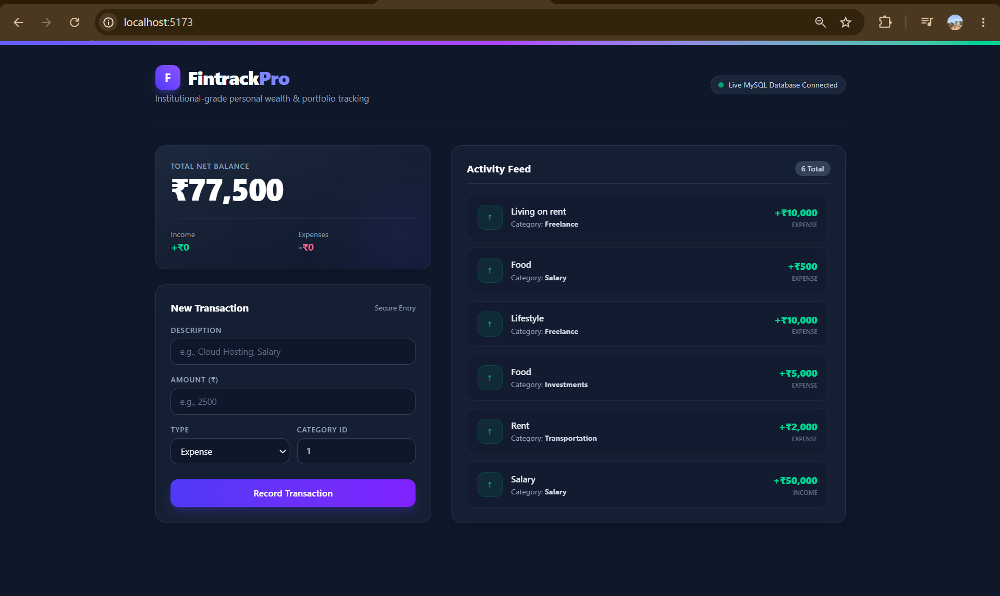

<div align="center">

# ⚡ FINTRACK-PRO // FULL-STACK FINTECH ENGINE

<p align="center">
  <b>A high-performance, enterprise-ready financial tracking ecosystem engineered for modern wealth management.</b>
</p>

<p align="center">
  
  
  
  
  
</p>

</div>


## 💻 Live Dashboard Preview

<div align="center">
  
</div>

---

## 🛠️ System Architecture & Tech Stack

Fintrack-Pro is structured with a decoupled client-server architecture to ensure maximum scalability, clean separation of concerns, and optimal query execution speeds.

* **Frontend:** React (Vite-powered), Tailwind CSS (Dark-mode optimized fintech UI), Axios for asynchronous HTTP routing.
* **Backend:** Node.js, Express.js RESTful API architecture with modular routing and controllers.
* **Database:** Relational MySQL database with optimized transaction logs and structured schema design.

---

## ⚙️ Core Engineering Modules

```text
my project/
├── my-api/                 # Backend Server Core
│   ├── config/             # Database connection pool setup
│   ├── controllers/        # Business logic & transaction handlers
│   ├── routes/             # API endpoint routing definitions
│   └── server.js           # Express app entry point
└── src/                    # Frontend Client Workspace
    ├── assets/             # UI graphics & branding elements
    ├── App.jsx             # Main dashboard view components
    └── index.css           # Tailwind styling configuration